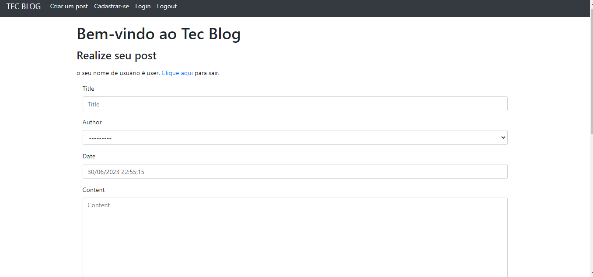

# Tec Blog.

### Teste de código.

Nesse repositório contém um projeto fullstack realizado o front-end com o BootStrap e o back-end com python e o framework
Django, (o códidigo encontra-se na branch developer).

O projeto consiste em um sistema de blog, onde o usuário do sistema consegue realizar login no sistema,
cadastrar novos usuários, cadastrar novos posts, comentários nos posts e visualizar os posts em uma página inicial.

exemplos:

- Rota para login (accounts/login/);
- Rota para cadastro de usuário (accounts/register/);
- Rota para o dashboard, obs: essa rota é acessível se o usuário estiver logado (accounts/dashboard/);
- Rota para o index que é a visualização dos posts cadastrados;
- Rota para visualização de um post específico e realizar comentários.

### Pré-requisitos

- Python devidamente instalado;
- Ambiente virtual criado e ativado
  - windows: python -m venv venv | venv\Scripts\activate.bat
  - linux: python -m venv/venv | source venv/bin/activate
- O banco de dados é de sua escolha, mas nesse projeto utilizei o SQLite;
- Instalação dos requirements.txt disponibilizados
- (Não é obrigatório para que o sistema funcione.) Criação de um superusuário para acesso da área administrativa do Django (python manage.py createsuperuser) e seguir o passo a passo.
- Rodar o comando: python manage.py makemigrations e em seguida python manage.py migrate para registro dos models no banco de dados.

### Execução do sistema

- Basta entrar no diretório do sistema e no terminal rodar o comando: python manage.py runserver
e o retorno é o http da página (index);

### Exemplo da execução

#### Rota para login (accounts/login/);

- Consta algumas validações, o formulário tem que estar preenchido
e com os dados certos para a liberação do acesso.

#### Rota para cadastro de usuário (accounts/cadastro/);

- Consta algumas validações, o formulário tem que estar preenchido,
o e-mail precisa ser um válido, o usuário precisa ter >= 6 caracteres,
a senha precisa ter >= 6 caracteres.

#### Rota para o dashboard (accounts/dashboard/);

- Obs: essa rota é acessível se o usuário estiver logado.
Aqui é onde o usuário LOGADO consegue cadastrar o seu contato,
o cadastro também conta com um campo onde consegue inserir uma imagem.

#### Rota para o index

- Aqui o usuário consegue visualizar os posts cadastrados,
conta com um sistema de paginação (limitei 3 contatos por página para exemplo), ao clicar no post será redirecionado para uma página com informações 
somente desse post e lá poderá realizar comentários.

- Visualização do post.

- Página de comentários do post.

